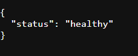
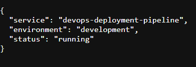
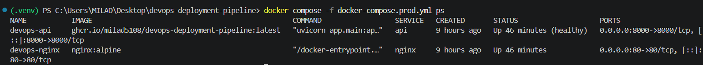
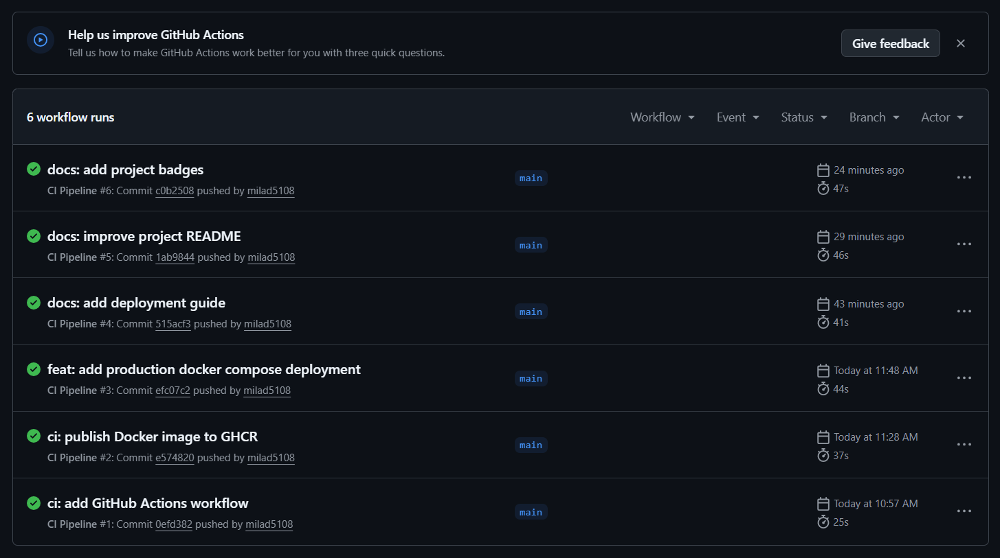
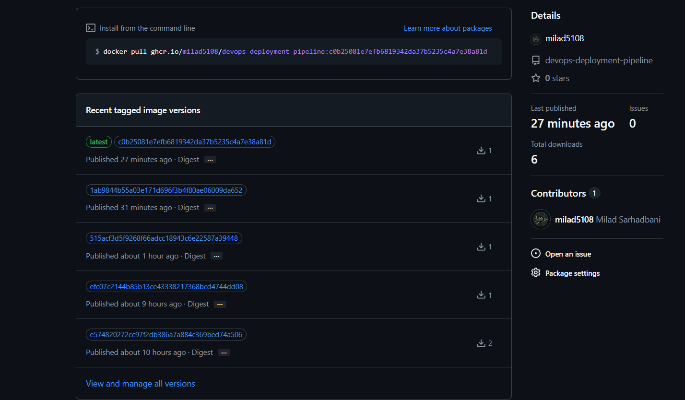

# Automated CI/CD Deployment Pipeline

[](https://github.com/milad5108/devops-deployment-pipeline/actions/workflows/ci.yml)


A production-oriented DevOps project demonstrating automated testing, Docker containerization, reverse proxy configuration, CI automation, and Docker image publishing.

## Project Overview

This project contains a FastAPI application packaged with Docker and managed using Docker Compose.

GitHub Actions automatically:

1. Checks out the repository
2. Sets up Python
3. Installs dependencies
4. Runs automated tests
5. Builds the Docker image
6. Publishes the image to GitHub Container Registry (GHCR)

Nginx is used as a reverse proxy in front of the FastAPI application.

---

## Architecture

```text
Developer
   |
   v
GitHub
   |
   v
GitHub Actions
   |
   +--> Automated Tests
   |
   +--> Docker Build
   |
   v
GitHub Container Registry (GHCR)
   |
   v
Docker Compose
   |
   v
Nginx :80
   |
   v
FastAPI :8000

```

---

## Screenshots

### Health Check



### API Status



### Production Docker Compose



### GitHub Actions



### GitHub Container Registry

